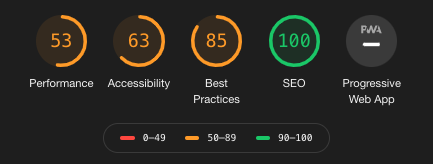

# Разработка PWA (Progressive Web Application) приложения на платформе Objectum


Предлагаю вашему вниманию реализацию PWA приложения на javascript платформе objectum.  
Это полноценное приложение каталога рецептов.  
Онлайн-демо http://objectum.ru:4000  
Исходный код https://github.com/objectum/recipes
  
Спецификация:
* Просмотр списка рецептов
* Рецепт содержит:
    * Наименование, способ приготовления, дата создания, время приготовления
    * Фотографии
    * Комментарии
    * Лайки, дизлайки
    * Привязка к пользователю
* Поиск рецептов
    * По названию
    * Свои рецепты
    * По лайкам    
* Регистрация пользователей    

## Инициализация проекта objectum

Устанавливаем утилиту командной строки:
```bash
npm i -g objectum-cli
```

Устанавливаем платформу:
```bash
mkdir /opt/objectum
objectum-cli --create-platform --path /opt/objectum
```
Для работы платформы нужны Redis и PostgreSQL. Параметры по умолчанию: 
```
--redis-host 127.0.0.1
--redis-port 6379
--objectum-port 8200
```

Создаем проект:
```bash
objectum-cli --create-project recipes --path /opt/objectum
```

Параметры по умолчанию:
```
--project-port 3100 - порт, где будет работать проект
--db-host 127.0.0.1 - хост и порт сервера PostgreSQL
--db-port 5432
--db-dbPassword 1 - пароль пользователя recipes
--db-dbaPassword 12345 - пароль администратора postgres
--password admin - пароль администратора проекта
```

Папка проекта создается инструментом create-react-app. На клиенте и сервере модули подключаются как ES Modules.

## Структура хранилища

Запускаем скрипт, который добавляет модели, свойства, запросы, колонки и записи:
```bash
cd /opt/objectum/projects/recipes
objectum-cli --import-json recipes-cli.json --file-directory files
```
Всё это можно создать через objectum ui, но проще скриптом.
<details>
  <summary>recipes-cli.json</summary>
  
```json
{
	"createModel": [
		{
			"name": "Рецепт",
			"code": "recipe"
		},
		{
			"parent": "t",
			"name": "Рецепт",
			"code": "recipe"
		},
		{
			"parent": "t.recipe",
			"name": "Фото",
			"code": "photo"
		},
		{
			"parent": "t.recipe",
			"name": "Комментарий",
			"code": "comment"
		},
		{
			"parent": "t.recipe",
			"name": "Лайк",
			"code": "like"
		}
	],
	"createProperty": [
		{
			"model": "recipe",
			"name": "Наименование",
			"code": "name",
			"type": "String",
			"notNull": 1
		},
		{
			"model": "recipe",
			"name": "Дата",
			"code": "date",
			"type": "Date",
			"notNull": 1
		},
		{
			"model": "recipe",
			"name": "Способ приготовления",
			"code": "cooking",
			"type": "String",
			"opts": {
				"wysiwyg": true,
				"rows": 15
			}
		},
		{
			"model": "t.recipe.photo",
			"name": "Рецепт",
			"code": "recipe",
			"type": "recipe",
			"notNull": 1,
			"removeRule": "cascade"
		},
		{
			"model": "t.recipe.photo",
			"name": "Фото",
			"code": "photo",
			"type": "File",
			"notNull": 1,
			"opts": {
				"image": {
					"aspect": 1,
					"thumbnail": "thumbnail"
				}
			}
		},
		{
			"model": "t.recipe.photo",
			"name": "Наименование",
			"code": "name",
			"type": "String"
		},
		{
			"model": "recipe",
			"name": "Пользователь",
			"code": "user",
			"type": "objectum.user"
		},
		{
			"model": "recipe",
			"name": "Время приготовления (мин.)",
			"code": "duration",
			"type": "Number"
		},
		{
			"model": "t.recipe.comment",
			"name": "Рецепт",
			"code": "recipe",
			"type": "recipe",
			"notNull": 1,
			"removeRule": "cascade"
		},
		{
			"model": "t.recipe.comment",
			"name": "Текст",
			"code": "text",
			"type": "String",
			"notNull": 1,
			"opts": {
				"wysiwyg": true
			}
		},
		{
			"model": "t.recipe.comment",
			"name": "Пользователь",
			"code": "user",
			"type": "objectum.user",
			"notNull": 1,
			"removeRule": "cascade"
		},
		{
			"model": "t.recipe.comment",
			"name": "Дата",
			"code": "date",
			"type": "Date",
			"notNull": 1
		},
		{
			"model": "t.recipe.like",
			"name": "Рецепт",
			"code": "recipe",
			"type": "recipe",
			"notNull": 1,
			"removeRule": "cascade"
		},
		{
			"model": "t.recipe.like",
			"name": "Пользователь",
			"code": "user",
			"type": "objectum.user",
			"notNull": 1,
			"removeRule": "cascade"
		},
		{
			"model": "t.recipe.like",
			"name": "Дата",
			"code": "date",
			"type": "Date",
			"notNull": 1
		},
		{
			"model": "t.recipe.like",
			"name": "Лайк",
			"code": "like",
			"type": "Boolean"
		},
		{
			"model": "t.recipe.like",
			"name": "Дизлайк",
			"code": "dislike",
			"type": "Boolean"
		},
		{
			"model": "t.recipe.photo",
			"name": "Миниатюра",
			"code": "thumbnail",
			"type": "File",
			"opts": {
				"image": {
					"aspect": 1,
					"resize": {
						"width": 200,
						"height": 200
					}
				}
			}
		}
	],
	"createQuery": [
		{
			"name": "Рецепт",
			"code": "recipe"
		},
		{
			"parent": "recipe",
			"name": "Лайки",
			"code": "like",
			"query": [
				"select",
				"    {\"prop\": \"a.recipe\", \"as\": \"recipe\"},",
				"\tsum ({\"prop\": \"a.like\"}) as like,",
				"\tsum ({\"prop\": \"a.dislike\"}) as dislike",
				"from",
				"    {\"model\": \"t.recipe.like\", \"alias\": \"a\"}",
				"group by",
				"\t{\"prop\": \"a.recipe\"}",
				""
			]
		},
		{
			"parent": "recipe",
			"name": "Комментарии",
			"code": "comment",
			"query": [
				"select",
				"    {\"prop\": \"a.recipe\", \"as\": \"recipe\"},",
				"\tcount (*) as num",
				"from",
				"    {\"model\": \"t.recipe.comment\", \"alias\": \"a\"}",
				"group by",
				"\t{\"prop\": \"a.recipe\"}",
				""
			]
		}
	],
	"createColumn": [],
	"createRecord": [
		{
			"_model": "objectum.role",
			"_ref": "ref-1013",
			"name": "Гость",
			"code": "guest",
			"menu": null
		},
		{
			"_model": "objectum.role",
			"_ref": "ref-1019",
			"name": "User",
			"code": "user",
			"menu": null
		},
		{
			"_model": "objectum.user",
			"_ref": "ref-1014",
			"name": "Гость",
			"login": "guest",
			"password": "35675E68F4B5AF7B995D9205AD0FC43842F16450",
			"role": {
				"_ref": "ref-1013"
			},
			"email": null,
			"opts": null
		}
	]
}  
```
</details>
  
  
Секции скрипта:  
* createModel - создание моделей
* createProperty - создание свойств
* createQuery - создание запросов
* createRecord - создание записей

## Компоненты

Понадобится добавить два компонента:
* Recipes - список рецептов
* Recipe - карточка рецепта

### Recipes - список рецептов

Компонент состоит из тулбара, списка рецептов и пагинации. Тулбар содержит фильтры по наименованию, своим рецептам, лайкам, дизлайкам.


<details>
  <summary>Recipes.js</summary>
  
```javascript
import React, {Component} from "react";
import {Link} from "react-router-dom";
import {StringField, Action, Pagination} from "objectum-react";
import RecipeModel from "../models/RecipeModel";

class Recipes extends Component {
	constructor (props) {
		super (props);
		
		this.state = {
			page: 0,
			pageRecs: 10
		};
	}
	
	async load ({page, search, user, recipes, like, reset} = {}) {
		let state = {
			page: page === undefined ? this.state.page : page,
			search: this.state.search,
			user: this.state.user,
			recipes: this.state.recipes,
			like: this.state.like
		};
		let filters = [];
		
		if (search || user || recipes || reset) {
			Object.assign (state, {search, user, recipes, like});
			
			if (!search) {
				state.searchValue = "";
			}
		}
		if (state.search) {
			filters.push (["name", "like", "%" + state.search]);
		}
		if (state.user) {
			filters.push (["user", "=", state.user]);
		}
		if (state.recipes) {
			filters.push (["id", "in", state.recipes]);
		}
		let data = await this.props.store.getData ({
			model: "recipe",
			offset: state.page * this.state.pageRecs,
			limit: this.state.pageRecs,
			filters
		});
		let recipeRecs = data.recs;
		
		recipes = recipeRecs.map (rec => rec.id);
		
		let [photoRecords, comments, likes] = await Promise.all ([
			this.props.store.getRecords ({
				model: "t.recipe.photo",
				filters: [
					["recipe", "in", recipes]
				]
			}),
			this.loadComments (recipes),
			this.loadLikes (recipes)
		]);
		this.setState (Object.assign (state, {recipeRecs, length: data.length, photoRecords}, comments, likes));
	}
	
	async componentDidMount () {
		await this.load ();
	}
	
	getLikes (id) {
		let rec = this.state.likeMap [id];
		
		return rec ? rec.like : 0;
	}
	
	getDislikes (id) {
		let rec = this.state.likeMap [id];
		
		return rec ? rec.dislike : 0;
	}
	
	async loadLikes (recipes) {
		let likeRecs = await this.props.store.getRecs ({
			query: "recipe.like",
			filters: [
				["recipe", "in", recipes]
			]
		});
		let likeMap = {};
		
		likeRecs.forEach (rec => likeMap [rec.recipe] = {like: rec.like || 0, dislike: rec.dislike || 0});
		
		return {likeRecs, likeMap};
	}
	
	onLike = async (like, id) => {
		await RecipeModel.like (this.props.store, like ,id);
		
		let {likeRecs, likeMap} = await this.loadLikes ();
		
		this.setState ({likeRecs, likeMap});
	}
	
	async loadComments (recipes) {
		let commentRecs = await this.props.store.getRecs ({
			query: "recipe.comment",
			filters: [
				["recipe", "in", recipes]
			]
		});
		let commentMap = {};
		
		commentRecs.forEach (rec => commentMap [rec.recipe] = rec.num);
		
		return {commentRecs, commentMap};
	}
	
	showLikes = async (like) => {
		let likeRecs = await this.props.store.getRecs ({
			model: "t.recipe.like",
			filters: [
				["user", "=", this.props.store.userId]
			]
		});
		likeRecs = likeRecs.filter (rec => {
			return (rec.like && like) || (rec.dislike && !like);
		});
		let recipes = likeRecs.map (rec => rec.recipe);
		
		await this.load ({recipes: recipes.length ? recipes : [0], like});
	}
	
	renderRecipe (rec) {
		let photos = this.state.photoRecords.filter (photo => photo.recipe == rec.id);

		return (
			<div key={rec.id} className="border p-1 mr-1 mb-1 card">
				<div className="">
					<Link className="btn btn-link text-left pt-0 pb-1 px-0 font-weight-bold" to={`/recipe/${rec.id}`}>{rec.name}</Link>
				</div>
				<div className="d-flex">
					<div className="card-photo">
						<div className="overflow-auto">
							<div className="d-flex">
								{photos.map ((photo, i) => {
									return (
										<div key={i} className="">
											
										</div>
									);
								})}
							</div>
						</div>
					</div>
					<div className="card-info p-1">
						{rec.user && <div className="">
							<i className="fas fa-user card-icon mr-2" />{this.props.store.dict ["objectum.user"][rec.user].name}
						</div>}
						{rec.duration && <div className="">
							<i className="fas fa-clock card-icon mr-2" />{rec.duration} мин.
						</div>}
						<div className="">
							<i className="fas fa-calendar-alt card-icon mr-2" />{rec.date.toLocaleDateString ()}
						</div>
						<div>
							<i className="fas fa-comment-alt card-icon mr-2" />{this.state.commentMap [rec.id] || 0}
						</div>
						<div className="mt-2 d-flex align-items-center">
							<Action btnClassName="btn btn-outline-primary" onClick={async () => await this.onLike (true, rec.id)}><i className="fas fa-thumbs-up" /></Action>
							<div className="px-2">{this.getLikes (rec.id)}</div>
							<Action btnClassName="btn btn-outline-danger" onClick={async () => await this.onLike (false, rec.id)}><i className="fas fa-thumbs-down" /></Action>
							<div className="px-2">{this.getDislikes (rec.id)}</div>
						</div>
						{rec.user == this.props.store.userId && <Link className="btn btn-outline-info mt-2" to={`/model_record/${rec.id}#{"opts":{"model":"recipe"}}`}><i className="fas fa-edit mr-1" />Изменить</Link>}
					</div>
				</div>
			</div>
		);
	}
	
	renderToolbar () {
		let isUser = this.props.store.roleCode == "user";
		
		return (
			<div className="row flex-row mb-1">
				<StringField placeholder="Поиск" value={this.state.searchValue} onChange={({value}) => this.setState ({searchValue: value})} />
				<Action
					className="ml-1" disabled={!this.state.searchValue} onClick={async () => await this.load (this.state.search ? {reset: true} : {search: this.state.searchValue})}
					btnClassName={`btn btn-primary btn-labeled mr-1 mb-1 ${this.state.search ? "active" : ""}`}
				><i className="fas fa-search mr-1" />Найти</Action>
				{isUser && <Action
					onClick={async () => await this.load (this.state.user ? {reset: true} : {user: this.props.store.userId})}
					btnClassName={`btn btn-primary btn-labeled mr-1 mb-1 ${this.state.user ? "active" : ""}`}
				><i className="fas fa-edit mr-1" />Мои рецепты</Action>}
				{isUser && <Action
					onClick={async () => this.state.like === true ? await this.load ({reset: true}) : await this.showLikes (true)}
					btnClassName={`btn btn-primary btn-labeled mr-1 mb-1 ${this.state.like === true ? "active" : ""}`}
				><i className="fas fa-thumbs-up" /></Action>}
				{isUser && <Action
					onClick={async () => this.state.like === false ? await this.load ({reset: true}) : await this.showLikes (false)}
					btnClassName={`btn btn-primary btn-labeled mr-1 mb-1 ${this.state.like === false ? "active" : ""}`}
				><i className="fas fa-thumbs-down" /></Action>}
			</div>
		);
	}
	
	renderRecipes () {
		let recipes = this.state.recipeRecs.map (rec => {
			return this.renderRecipe (rec);
		});
		return (
			<div className="row flex-row">
				{recipes}
			</div>
		);
	}
	
	renderPagination () {
		if (this.state.length < this.state.pageRecs) {
			return null;
		}
		let items = [];
		
		for (let i = 0; i < this.state.length / this.state.pageRecs; i ++) {
			items.push (i + 1);
		}
		return (
			<div className="mt-2">
				<Pagination items={items} active={this.state.page} onChange={async (page) => {
					await this.load ({page});
				}} />
			</div>
		);
	}
	
	render () {
		if (!this.state.recipeRecs) {
			return null;
		} else {
			return (
				<div className="container">
					<div className="pl-1 pt-1">
						{this.renderToolbar ()}
						{this.renderRecipes ()}
						{this.renderPagination ()}
					</div>
				</div>
			);
		}
	}
};
```
</details>
  
Методы:
* constructor - инициализируются параметры. Текущая страница 0, рецептов на странице показывать 10
* load - загрузка рецептов, а также комментариев loadComments и лайков loadLikes
* renderRecipe - карточка рецепта. Отображает фото и детали рецепта. 
    * Показывает лайки с помощью методов getLikes, getDislikes
    * Есть кнопки для лайка, дизлайка - метод onLike
    * Кнопка "Изменить" меняет ссылку на карточку рецепта с функциями редактирования
* renderToolbar - фильтры
    * Поиск, Найти - поиск по части слова. В методе load в запрос добавляется фильтр
    * Мои рецепты - в методе load в запрос добавляется фильтр по текущему пользователю
    * Лайки, дизлайки - в методе load в запрос добавляется фильтр по рецептам. Список рецептов составляется с помощью метода showLikes
* renderRecipes - список рецептов
* renderPagination - пагинация

### Recipe - рецепт

Компонент отображает рецепт с фото и комментариями.


<details>
  <summary>Recipe.js</summary>
  
```javascript
import React, {Component} from "react";
import {Action, StringField} from "objectum-react";
import RecipeModel from "../models/RecipeModel";
import {Link} from "react-router-dom";

class Recipe extends Component {
	constructor (props) {
		super (props);
		
		this.state = {
			id: this.props.match.params.id
		};
	}
	
	async componentDidMount () {
		let [recipeRecord, photoRecords, commentRecords, likes] = await Promise.all ([
			this.props.store.getRecord (this.state.id),
			this.props.store.getRecords ({
				model: "t.recipe.photo",
				filters: [
					["recipe", "=", this.state.id]
				]
			}),
			this.props.store.getRecords ({
				model: "t.recipe.comment",
				filters: [
					["recipe", "=", this.state.id]
				]
			}),
			this.loadLikes ()
		]);
		this.setState (Object.assign ({recipeRecord, photoRecords, commentRecords}, likes));
	}
	
	async loadLikes () {
		let likeRecs = await this.props.store.getRecs ({
			model: "t.recipe.like",
			filters: [
				["recipe", "=", this.state.id]
			]
		});
		let likeNum = 0;
		let dislikeNum = 0;
		
		likeRecs.forEach (rec => {
			if (rec.like) {
				likeNum ++;
			}
			if (rec.dislike) {
				dislikeNum ++;
			}
		});
		return {likeRecs, likeNum, dislikeNum};
	}
	
	onLike = async (like, id) => {
		await RecipeModel.like (this.props.store, like ,id);
		this.setState (await this.loadLikes ());
	}
	
	onComment = async () => {
		await this.props.store.startTransaction ("new comment");
		await this.props.store.createRecord ({
			_model: "t.recipe.comment",
			recipe: this.state.id,
			date: new Date (),
			user: this.props.store.userId,
			text: this.state.text
		});
		await this.props.store.commitTransaction ("new comment");
		this.setState ({
			text: "",
			commentRecords: await this.props.store.getRecords ({
				model: "t.recipe.comment",
				filters: [
					["recipe", "=", this.state.id]
				]
			})
		});
	}
	
	renderComments () {
		return (
			<div className="mt-4">
				<h5 className="font-weight-bold">Комментарии: {this.state.commentRecords.length}</h5>
				{this.state.commentRecords.map ((record, i) => {
					let userRecord = this.props.store.dict ["objectum.user"][record.user];
					
					return (
						<div key={i} className="mt-2">
							<div className="font-weight-bold">{userRecord.name}</div>
							<div className="font-italic">{record.date.toLocaleString ()}</div>
							<div>{record.text}</div>
						</div>
					);
				})}
				<div className="mt-2">
					<StringField onChange={({value}) => this.setState ({text: value})} placeholder="Добавить комментарий" />
					{this.props.store.roleCode == "user" ? <Action
						className="mt-1" btnClassName="btn btn-outline-primary"
						label="Отправить" icon="fas fa-plus" onClick={this.onComment}
						disabled={!this.state.text}
					/> :
					<Link className="btn btn-outline-info mt-1" to="/office">Необходимо авторизоваться</Link>}
				</div>
			</div>
		);
	}
	
	render () {
		if (!this.state.recipeRecord) {
			return null;
		}
		let record = this.state.recipeRecord;
		
		return (
			<div className="p-1">
				<div className="d-flex overflow-auto p-1 border">
					{this.state.photoRecords.map ((photo, i) => {
						return (
							<div key={i} className="">
								<a href={photo.getRef ("photo")} target="_blank" rel="noopener noreferrer">
									
								</a>
							</div>
						);
					})}
				</div>
				<div className="mt-1 p-1 border">
					<h5 className="font-weight-bold my-2">{record.name}</h5>
					{record.user && <div className="">
						<i className="fas fa-user menu-icon mr-2" />{this.props.store.dict ["objectum.user"][record.user].name}
					</div>}
					{record.duration && <div className="">
						<i className="fas fa-clock menu-icon mr-2" />{record.duration} мин.
					</div>}
					<div className="">
						<i className="fas fa-calendar-alt menu-icon mr-2" />{record.date.toLocaleString ()}
					</div>
					<div className="my-2 p-1 d-flex align-items-center">
						<Action btnClassName="btn btn-outline-primary" onClick={async () => await this.onLike (true, record.id)}><i className="fas fa-thumbs-up" /></Action><span className="px-2 like">{this.state.likeNum}</span>
						<Action btnClassName="btn btn-outline-danger" onClick={async () => await this.onLike (false, record.id)}><i className="fas fa-thumbs-down" /></Action><span className="px-2 like">{this.state.dislikeNum}</span>
						{record.user == this.props.store.userId && <Link className="btn btn-outline-info" to={`/model_record/${record.id}#{"opts":{"model":"recipe"}}`}><i className="fas fa-edit" /></Link>}
					</div>
					<div dangerouslySetInnerHTML={{__html: record.cooking}} />
					{this.renderComments ()}
				</div>
			</div>
		);
	}
};
```
</details>
  
Методы:
* componentDidMount - загружает данные по рецепту. Вызывает метод loadLikes
* render - выводит информацию по рецепту 
    * Есть кнопки для лайка, дизлайка - метод onLike
    * Кнопка "Изменить" меняет ссылку на карточку рецепта с функциями редактирования
    * Комментарии выводятся с помощью метода renderComments
* renderComments - выводит комментарии. Новый комментарий добавляет с помощью onComment      

### App

Заменяем рендер приложения по умолчанию на новый рендер onCustomRender. Автоматически авторизуем пользователя "Гость".

<details>
  <summary>App.js</summary>
  
```javascript
import React, {Component} from "react";
import {Store} from "objectum-client";
import {ObjectumApp, ObjectumRoute, Navbar, Office, Loading} from "objectum-react";
import Recipes from "./components/Recipes";
import Recipe from "./components/Recipe";
import RecipeModel from "./models/RecipeModel";
import RecipePhotoModel from "./models/RecipePhotoModel";
import RecipeCommentModel from "./models/RecipeCommentModel";
import RecipeLikeModel from "./models/RecipeLikeModel";

import "./css/bootstrap.css";
import "objectum-react/lib/css/objectum.css";
import "objectum-react/lib/fontawesome/css/all.css";
import "./css/recipes.css";

const store = new Store ();

class App extends Component {
	constructor (props) {
		super (props);

		store.setUrl ("/api");
		
		store.register ("recipe", RecipeModel);
		store.register ("t.recipe.photo", RecipePhotoModel);
		store.register ("t.recipe.comment", RecipeCommentModel);
		store.register ("t.recipe.like", RecipeLikeModel);
		
		this.state = {
			name: process.env.REACT_APP_NAME || "Просторецепты"
		};
		window.store = store;
	}
	
	onConnect = async () => {
		if (!store.dict ["objectum.user"]) {
			await store.getDict ("objectum.user");
		}
		let state = {
			username: store.username,
			roleCode: store.roleCode
		};
		if (store.username != "guest" && store.userId) {
			state.userRecord = await store.getRecord (store.userId);
		}
		this.setState (state);
	}
	
	onDisconnect = async () => {
		await store.auth ({
			username: "guest",
			password: require ("crypto").createHash ("sha1").update ("guest").digest ("hex").toUpperCase ()
		});
	}
	
	onCustomRender = ({content, app, location}) => {
		if (!this.state.username) {
			return <Loading container />
		}
		if (this.state.roleCode === "guest" || this.state.roleCode === "user") {
			let items = [
				"back",
				{
					label: "Рецепты",
					icon: "fas fa-utensils",
					path: "/recipes"
				},
				...(store.roleCode == "user" ? [
					{
						label: "Добавить",
						icon: "fas fa-plus",
						path: '/model_record/new#{"opts":{"model":"recipe"}}'
					}
				] : []),
				{
					label: "Вход",
					icon: "fas fa-sign-in-alt",
					path: "/office"
				}
			];
			return (
				<div className="container shadow p-0">
					<Navbar className="navbar navbar-expand navbar-dark bg-dark" items={[
						{
							label: `${this.state.name}${this.state.username == "guest" ? "" : ` (${this.state.userRecord.name})`}`,
							path: "/"
						}
					]} />
					<Navbar expand iconsTop app={app} items={items}/>
					<div className="bg-white py-1">
						{content}
					</div>
				</div>
			);
		}
	}
	
	render () {
		let props = {
			store,
			locale: "ru",
			name: this.state.name,
			version: process.env.REACT_APP_VERSION,
			onCustomRender: this.onCustomRender,
			onConnect: this.onConnect,
			onDisconnect: this.onDisconnect,
			registration: true,
			username: "guest",
			password: require ("crypto").createHash ("sha1").update ("guest").digest ("hex").toUpperCase (),
			iconsTop: true
		};
		return (
			<ObjectumApp {...props}>
				<ObjectumRoute exact path="/" render={props => <Recipes {...props} store={store} />} />
				<ObjectumRoute exact path="/recipes" render={props => <Recipes {...props} store={store} />} />
				<ObjectumRoute exact path="/recipe/:id" render={props => <Recipe {...props} store={store} />} />
				<ObjectumRoute exact path="/office" render={props => <div className="p-3">
					<Office {...props} cardClassName="rounded p-3 border" store={store} name={this.state.name} siteKey="6LffszoUAAAAALAe2ghviS8wqitVKvsR1bFMwtcK" />
				</div>} />
			</ObjectumApp>
		);
	}
};		
```
</details>

Методы:
* constructor - регистрация моделей
* onConnect - вызывается при подключении к хранилищу. Сохраняет в состояние запись пользователя
* onDisconnect - при отключении пользователя авторизуемся под гостем

По кнопке "Вход" используется компонент Office, где возможна регистрация пользователя, вход и восстановление пароля:


## Модели

Добавляем исходный код моделей для улучшения внешнего вида и некоторые действия.

### RecipeCommentModel

Модель: Комментарий.

<details>
  <summary>RecipeCommentModel.js</summary>
  
```javascript
import React from "react";
import {Record} from "objectum-client";

class RecipeCommentModel extends Record {
	static _renderGrid ({grid, store}) {
		return React.cloneElement (grid, {
			label: ""
		});
	}
	
	static _layout () {
		return [
			"id",
			[
				"recipe"
			],
			[
				"user"
			],
			[
				"date"
			],
			[
				"text"
			]
		];
	}
};
```
</details>

* _renderGrid - убирает заголовок в таблице комментариев в карточке рецепта
* _layout - макет карточки комментария. Выводит 4 поля по одному на строку

### RecipeLikeModel

Модель: Лайк.

<details>
  <summary>RecipeLikeModel.js</summary>
  
```javascript
import React from "react";
import {Record} from "objectum-client";

class RecipeLikeModel extends Record {
	static _renderGrid ({grid, store}) {
		return React.cloneElement (grid, {
			label: ""
		});
	}
	
	static _layout () {
		return [
			"id",
			[
				"recipe"
			],
			[
				"user"
			],
			[
				"date"
			],
			[
				"like"
			],
			[
				"dislike"
			]
		];
	}
};
```
</details>

* _renderGrid - убирает заголовок в таблице лайков в карточке рецепта
* _layout - макет карточки лайка. Выводит 5 полей по одному на строку

### RecipePhotoModel

Модель: Фото.

<details>
  <summary>RecipePhotoModel.js</summary>
  
```javascript
import React from "react";
import {Record} from "objectum-client";

class RecipePhotoModel extends Record {
	static _renderGrid ({grid, store}) {
		return React.cloneElement (grid, {
			label: ""
		});
	}

	static _layout () {
		return [
			"id",
			[
				"recipe"
			],
			[
				"name"
			],
			[
				"photo"
			]
		];
	}
};
```
</details>

* _renderGrid - убирает заголовок в таблице фото в карточке рецепта
* _layout - макет карточки фото. Выводит 3 поля по одному на строку

### RecipeModel

Модель: Рецепт.  

Редактирование рецепта:


<details>
  <summary>RecipeModel.js</summary>
  
```javascript
import React from "react";
import {Record} from "objectum-client";

class RecipeModel extends Record {
	static _renderGrid ({grid, store}) {
		return React.cloneElement (grid, {
			label: "Рецепты"
		});
	}
	
	static _layout () {
		return {
			"Информация": [
				"id",
				[
					"user"
				],
				[
					"name"
				],
				[
					"date"
				],
				[
					"duration"
				],
				[
					"cooking"
				]
			],
			"Фото": [
				[
					"t.recipe.photo"
				]
			],
			"Комментарии": [
				[
					"t.recipe.comment"
				]
			],
			"Лайки, дизлайки": [
				[
					"t.recipe.like"
				]
			]
		};
	}
	
	static _renderForm ({form, store}) {
		return React.cloneElement (form, {
			defaults: {
				date: new Date (),
				user: store.userId
			}
		});
	}
	
	static _renderField ({field, store}) {
		if (field.props.property === "date") {
			return React.cloneElement (field, {showTime: true});
		} else if (field.props.property === "user" && store.roleCode == "user") {
			return React.cloneElement (field, {disabled: true});
		} else {
			return field;
		}
	}
	
	_renderField ({field, store}) {
		return RecipeModel._renderField ({field, store});
	}
	
	static async like (store, like, id) {
		if (store.roleCode != "user") {
			throw new Error ("Необходимо авторизоваться");
		}
		let records = await store.getRecords ({
			model: "t.recipe.like",
			filters: [
				["recipe", "=", id],
				["user", "=", store.userId]
			]
		});
		if (records.length) {
			let record = records [0];
			
			if ((like && !record.like) || (!like && !record.dislike)) {
				await store.startTransaction ("like");
				record.like = like;
				record.dislike = !like;
				await record.sync ();
				await store.commitTransaction ();
			}
		} else {
			await store.startTransaction ("like");
			await store.createRecord ({
				_model: "t.recipe.like",
				recipe: id,
				user: store.userId,
				date: new Date (),
				like,
				dislike: !like
			});
			await store.commitTransaction ();
		}
	}
};
```
</details>

* _renderGrid - задает заголовок в таблице
* _layout - макет карточки рецепта
    * Информация - 1-я закладка. Выводит 5 полей по одному на строку 
    * Фото - закладка содержит таблицу с фото
    * Комментарии - закладка содержит таблицу с комментариями
    * Лайки, дизлайки - закладка содержит таблицу с лайками
* _renderForm - устанавливает значения по умолчанию при добавлении рецепта. Текущая дата и текущий пользователь.
* static _renderField - вызывается при добавлении рецепта. Добавляет время в поле "Дата" и выключает поле "Пользователь".
* _renderField - вызывается при редактировании рецепта
* like - добавляет лайк рецепту или меняет его

# Безопасность

Контроль доступа реализуется набором методов.

<details>
  <summary>RecipeModel.js</summary>
  
```javascript
let map = {
	"guest": {
		"data": {
			"model": {
				"recipe": true, "t.recipe.photo": true, "t.recipe.comment": true, "t.recipe.like": true, "objectum.user": true
			},
			"query": {
				"objectum.userMenuItems": true, "recipe.comment": true, "recipe.like": true
			}
		},
		"read": {
			"objectum.role": true, "objectum.user": true, "objectum.menu": true, "objectum.menuItem": true, "recipe": true
		}
	}
};
async function _init ({store}) {
};

function _accessData ({store, data}) {
	if (store.roleCode == "guest") {
		if (data.model) {
			return map.guest.data.model [store.getModel (data.model).getPath ()];
		}
		if (data.query) {
			return map.guest.data.query [store.getQuery (data.query).getPath ()];
		}
	} else {
		return true;
	}
};

function _accessDataAfter ({store, data, resData}) {
	if (data.model == "objectum.user") {
		let n = 0;
		
		for (; resData.cols [n].code != "password"; n ++) {}
		
		resData.recs.forEach (rec => rec [n] = "");
		return resData;
	}
	return true;
};

function _accessFilter ({store, model, alias}) {
};

function _accessCreate ({store, model, data}) {
	return store.roleCode != "guest";
};

function _accessRead ({store, model, record}) {
	let modelPath = model.getPath ();
	
	if (store.roleCode == "guest") {
		if (modelPath == "objectum.user") {
			return record.login == "guest";
		}
		return map.guest.read [modelPath];
	}
	return true;
};

function _accessUpdate ({store, model, record, data}) {
	if (store.roleCode == "guest") {
		return false;
	}
	if (store.roleCode == "user" && record.user != store.userId) {
		return false;
	}
	return true;
};

function _accessDelete ({store, model, record}) {
	if (store.roleCode == "guest") {
		return false;
	}
	if (store.roleCode == "user" && record.user != store.userId) {
		return false;
	}
	return true;
};
```
</details>

Методы:
* _init - инициализация модуля при старте приложения
* _accessData - вызывается при выполнении метода store.getData
* _accessDataAfter - вызывается после выполнении метода store.getData. Можно изменить данные в ответе
* _accessFilter - записи по каждой модели в запросе могут фильтроваться. Из метода возвращается фильтр
* Доступ к записям:
    * _accessCreate - гостю запрещено создавать записи 
    * _accessRead - гостю можно читать только модели указанные в map.guest.read. Из записей по пользователям можно читать только свою 
    * _accessUpdate, _accessDelete - гостю нельзя менять записи. Пользователю можно менять только свои записи

Если метод возвращает true, то вызов метода разрешен.

## Серверный код

javascript код изоморфный потому нужна только инициализация безопасности и моделей с серверными методами.

<details>
  <summary>index.js</summary>
  
```javascript
import Proxy from "objectum-proxy";
import fs from "fs";
import {fileURLToPath} from "url";
import {dirname} from "path";

import accessMethods from "./src/modules/access.js";

const __filename = fileURLToPath (import.meta.url);
const __dirname = dirname (__filename);
const config = JSON.parse (fs.readFileSync ("./config.json", "utf8"));
const proxy = new Proxy ();

proxy.registerAdminMethods (
	proxy.getOfficeMethods ({role: "user", smtp: config.smtp, secret: config.secret, secretKey: config.secretKey})
);
proxy.registerAccessMethods (accessMethods);

proxy.start ({config, path: "/api", __dirname});
```
</details>

proxy.getOfficeMethods - инициализация методов для регистрации пользователей.
* role - пользователей какой роли регистрируем (код)
* smtp - параметры для отправки писем
* secret - "соль" строка.
* secretKey - приватный ключ для google recaptcha

## PWA

Добавляем манифест, который содержит название программы, иконки и другие параметры.
manifest.json:
```json
{
  "short_name": "Просторецепты",
  "name": "Просторецепты",
  "icons": [
    {
      "src": "favicon.ico",
      "sizes": "64x64 32x32 24x24 16x16",
      "type": "image/x-icon"
    },
    {
      "src": "logo192.png",
      "type": "image/png",
      "sizes": "192x192"
    },
    {
      "src": "logo512.png",
      "type": "image/png",
      "sizes": "512x512"
    }
  ],
  "start_url": ".",
  "display": "standalone",
  "theme_color": "#000000",
  "background_color": "#ffffff"
}
```

Добавляемы необходимый для PWA файл. В данном проекте используется только для управления кэшем.  
service-worker ([взял отсюда]([https://habr.com/ru/company/mailru/blog/450504])):
```javascript
let doCache = true;

// Имя кэша
let CACHE_NAME = "my-pwa-cache";

// Очищает старый кэш
self.addEventListener ("activate", event => {
	const cacheWhitelist = [CACHE_NAME];
	
	event.waitUntil (
		caches.keys ()
		.then (keyList =>
			Promise.all (keyList.map (key => {
				if (!cacheWhitelist.includes (key)) {
					console.log ("Deleting cache: " + key);
					return caches.delete (key);
				}
			}))
		)
	);
});
// 'install' вызывается, как только пользователь впервые открывает PWA
self.addEventListener ("install", function (event) {
	if (doCache) {
		event.waitUntil (
			caches.open (CACHE_NAME)
			.then (function (cache) {
				// Получаем данные из манифеста (они кэшируются)
				fetch ("/manifest.json")
				.then (response => {
					response.json ()
				})
				.then (assets => {
					// Открываем и кэшируем нужные страницы и файлы
					const urlsToCache = [
						"/"
					];
					cache.addAll (urlsToCache)
					console.log ("cached");
				})
			})
		);
	}
});

// Когда приложение запущено, сервис-воркер перехватывает запросы и отвечает на них данными из кэша, если они есть
self.addEventListener ("fetch", function (event) {
	if (doCache) {
		event.respondWith (
			caches.match (event.request).then (function (response) {
				return response || fetch (event.request);
			})
		);
	}
});
```

## Заключение

Как видите кода понадобилось немного.   
Показатели lighthouse неплохие, но надо учитывать что это react приложение.  


Спасибо за внимание.
